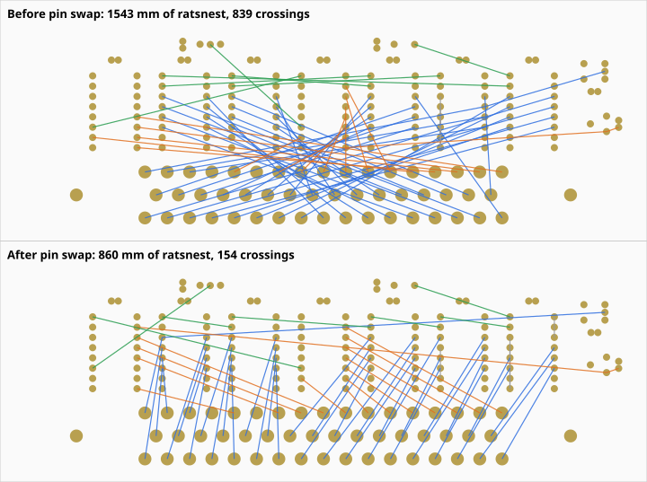

# Solartron 7075 USB interface (atopile)

An RP2354A USB interface that plugs straight into the 50-way SKB socket of a
Solartron 7075 DVM fitted with the 70754 Parallel BCD Interface Unit (service
manual, section 9). Every signal to and from the meter crosses an optical
isolation barrier, so USB ground noise never reaches the meter's ground. SKB
pin 37 is the meter's earth and logic 0.

Designed with atopile 0.15.9 (`ato build`). The parts come from atopile's
package library where it had them, and from LCSC otherwise.

## Architecture

```
 USB side (GND)                         |  DVM side (GND_ISO)
                                        |
 USB-B (vertical) -> 500 mA PTC, USBLC6 |
   +5V --+--> TLV75901 -> +3V3          |
         +--> IB0505LS-1WR3 ===========>|==> +5V_ISO (regulated, 1.5 kV)
                                        |
 RP2354A  GPIO18 SCK  --> TLP2361 ======|==> SCK_ISO   -> 5x 74HCT165 CP, 2x 74HCT595 SHCP
          GPIO19 MOSI --> TLP2361 ======|==> MOSI_ISO  -> first 74HCT595 DS
          GPIO17 LATCH--> TLP2361 ======|==> LATCH_ISO -> 74HCT165 /PL, 74HCT595 STCP
          GPIO20 OE_N --> TLP2361 ======|==> OE_N_ISO  -> 74HCT595 /OE (10 k pull-up)
          GPIO16 MISO <-- TLP2361 ======|<== first 74HCT165 Q7
          GPIO21 DRDY <-- TLP2361 ======|<== 74AHCT1G125 <- SKB 34 (PRINT level)
                                        |
                                        |   SKB 1-36  (BCD, polarity, function, range,
                                        |              print, data-can-change, overload)
                                        |              -> 5x 74HCT165 (40-bit chain)
                                        |   SKB 38, 40-50 <- 2x 74HCT595 (16-bit chain)
                                        |   SKB 39 (contact SAMPLE) <- 2N7002 to pin 37
```

* Only six logic signals cross the barrier. Each goes through a Toshiba
  TLP2361 optocoupler (15 MBd, 80 ns max delay). Every channel is
  non-inverting: the MCU or HCT output sinks the LED cathode, and the anode
  is fed from 330 Ω (3.3 V side) or 680 Ω (5 V side), about 4.5 mA.
* The DVM side uses HCT logic at 5 V because the 7075's outputs are TTL
  levels: a '1' is +2.4 to +6 V from a 6 kΩ source. The 74HCT595 outputs
  sink 6 mA at under 0.33 V, which meets the 7075 input spec of under 0.5 V
  at 5 mA.
* **Safe at reset.** While the MCU is in reset or not yet configured, its
  GPIOs are Hi-Z, so the opto LEDs are off and every isolated line idles
  high. That keeps `OE_N_ISO` high, so the 595 outputs stay Hi-Z and the
  meter's command inputs sit at its own pull-ups, exactly as if nothing were
  connected. Manual §9, diagram 9.2 (70754 board 2) confirms the pull-ups:
  * every command input has 4.7 kΩ to +5 V into 74-series TTL, so Hi-Z reads
    '1' = inactive (no lockout, no ratio, DC, 10 s, autorange; the manual's
    "REMOTE with nothing connected" state)
  * CONTACT SAMPLE has 2.2 kΩ to +5 V, so with the MOSFET off there is no
    sample
  * PULSE SAMPLE is AC-coupled (47 kΩ + 22 nF), so only a rising edge
    triggers it
* The four spare 74HCT165 inputs are tied to two 1s and two 0s, so firmware
  can detect a broken link or a missing isolated supply. Their places in the
  frame are in the read-frame table below.

## Firmware interface

SPI0 runs in mode 0 at 1 MHz or less. The limit comes from the round trip
through two optos, about 200 ns. **LATCH must be driven as a plain GPIO**, not
as the SPI chip select, because the 74HCT165s are held in load mode while it
is low. Set GPIO17–20 to 8 mA drive.

One transaction:

1. Pulse LATCH (GPIO17) low for at least 1 µs, then return it high. The
   rising edge does two things: the 165s capture the DVM outputs, and the
   595s present the command word that was shifted in last time.
2. Exchange 5 bytes over SPI. MOSI = `00 00 00 CMD_HI CMD_LO`. MISO = 5
   status bytes.
3. To apply the new command now, pulse LATCH again. Otherwise it is applied
   at the next transaction.
4. After the first valid command has been latched, drive OE_N (GPIO20) low.
   That command must have the PULSE SAMPLE bit = 0. PULSE SAMPLE is
   AC-coupled in the meter, so enabling the outputs with that bit = 1 would be
   a rising edge and would trigger a sample.

DRDY (GPIO21) follows SKB pin 34, PRINT level. It goes high when a reading is
complete and the outputs have been updated.

<!-- BEGIN bit maps: generated by scripts/pin_swap.py -->
### Read frame (MISO, MSB first)

Each cell gives the SKB pin and its meaning. `1`/`0` are the link-check
constants: firmware should check them on every read.

| Byte | bit7 | bit6 | bit5 | bit4 | bit3 | bit2 | bit1 | bit0 |
|---|---|---|---|---|---|---|---|---|
| 0 | `0` | 33 PRINT pulse | 16 2×10² | 17 1×10² | 15 4×10² | 32 range (1) | `1` | `1` |
| 1 | 30 range (4) | 13 1×10³ | 31 range (2) | 14 8×10² | 12 2×10³ | 29 function B | `0` | 11 4×10³ |
| 2 | 9 1×10⁴ | 27 −ve | 10 8×10³ | 28 function A | 26 +ve | 8 2×10⁴ | 25 1×10⁰ | 24 2×10⁰ |
| 3 | 22 8×10⁰ | 6 8×10⁴ | 23 4×10⁰ | 7 4×10⁴ | 5 1×10⁵ | 21 1×10¹ | 4 2×10⁵ | 20 2×10¹ |
| 4 | 2 8×10⁵ | 19 4×10¹ | 36 OVERLOAD | 3 4×10⁵ | 18 8×10¹ | 35 DATA CAN CHANGE | 1 1×10⁶ | 34 PRINT level |

### Command word (MOSI bytes 3–4, CMD_HI = bits 15–8)

| Bit | SKB pin | Signal (manual §9) |
|---|---|---|
| 0 | – | unused |
| 1 | 38 | FRONT PANEL LOCKOUT (0 = locked out) |
| 2 | – | unused |
| 3 | – | unused |
| 4 | 40 | PULSE SAMPLE (pulse high for more than 100 µs) |
| 5 | 41 | RATIO (0 = ratio) |
| 6 | 42 | FUNCTION A |
| 7 | 39 | CONTACT SAMPLE (1 = MOSFET closes 39 to 37) |
| 8 | 43 | FUNCTION B |
| 9 | 44 | Integration time (4) |
| 10 | 45 | Integration time (2) |
| 11 | 46 | Integration time (1) |
| 12 | 47 | AUTORANGE (1 = autorange inhibited, use the commanded range) |
| 13 | 48 | Range (1) |
| 14 | 49 | Range (2) |
| 15 | 50 | Range (4) |

* FUNCTION, read as (43, 42): 11 = DC, 01 = AC, 10 = Ω, 00 = CHECK.
* Integration time, read as (44, 45, 46) = (4)(2)(1): 011 = 1 ms, 100 = 20 ms,
  101 = 100 ms, 110 = 1 s, 111 = 10 s.
* Range, read as (50, 49, 48) = (4)(2)(1): 000 = 1000 V / 10 MΩ … 101 = 10 mV /
  100 Ω, 110 = auto / 10 Ω, 111 = auto.
<!-- END bit maps -->

Commands only take effect while the meter is in REMOTE. That means either the
REMOTE button is pressed, or the FRONT PANEL LOCKOUT bit = 0.

## Board


* 78 × 60 mm rectangle, 2 layers. It sits flat on the back of the meter and
  has no mounting holes.
* **Bottom face:** Amphenol DD50P364TXLF, a vertical PCB-mount DD-50 plug. It
  mates with SKB and is held by 4-40 jackscrews through its 3.1 mm flange
  holes. The top face is kept clear within 4 mm of each jackscrew for the
  screw heads.
* **Top face:**
  * the vertical USB-B (SHOU HAN BF 180) and the rest of the components
  * isolation barrier along the board centreline: a 3.2 mm keep-out with no
    tracks, vias or pour, crossed only by the six TLP2361s and the SIP DC-DC
  * GND pour on the USB half and GND_ISO pour on the DVM half, both layers
* `scripts/place_components.py` produces the initial placement and the zones,
  using atopile's own `PCB_Transformer`. `scripts/check_layout.py` checks:
  * every pad is inside the outline
  * no footprints overlap
  * all USB-side pads are north of the barrier and all DVM-side pads south
  * the jackscrew keep-outs are clear
* The TLV75901 library module arrives pre-routed. The placement script moves
  its parts, tracks and vias as one rigid block so that routing stays valid.
* `layouts/default/default.kicad_pro` sets JLCPCB 2-layer minimums
  (0.127 mm track/space, 0.3 mm drill) and a 0.25 mm default track.
* **Not done yet:** routing. Open `layouts/default/default.kicad_pcb` in
  KiCad 10 to route it and fill the zones.

### Pin swapping



Blue: SKB outputs to 74HCT165 inputs. Orange: 74HCT595 outputs to SKB
command inputs and the SAMPLE MOSFET. Green: the two shift chains.

`scripts/pin_swap.py` decides which SKB signal goes on which shift-register
pin. Swaps are made within a part and between parts; part positions are
unchanged.
* Any SKB output (pins 1–36) can go on any of the 40 74HCT165 inputs. The
  four link-check constants take the spare inputs.
* Any SKB command input (38, 40–50) and the SAMPLE MOSFET gate can go on any
  of the 16 74HCT595 outputs.
* The order of the five 165s in their chain, and of the two 595s, is free.

The script minimises ratsnest length plus 5 mm per ratsnest crossing, using
seeded simulated annealing. It then rewrites the generated `pin map` block in
`main.ato` and the bit-map tables under "Firmware interface", so the firmware
tables always match the board.

| DVM-side ratsnest | Before | After |
|---|---|---|
| SKB outputs → 165 inputs | 1060 mm | 506 mm |
| 595 outputs → SKB inputs and MOSFET gate | 303 mm | 236 mm |
| 165 chain (MISO_ISO, SI_CHAIN_1–4) | 124 mm | 56 mm |
| Total, including the 595 chain and constants | 1544 mm | 860 mm |
| Ratsnest crossings | 839 | 154 |

As an independent check, both versions of the whole board were autorouted
with Freerouting 2.1 for 40 minutes each, side by side on the same machine.
(2.1 was built from source; 2.5 needs Java 25.) Neither board finished, and
Freerouting logged internal errors on both. The pin-swapped board still
routed clearly better:

| Freerouting 2.1, 40 min each | Before | After |
|---|---|---|
| Passes completed | 55 | 456 |
| Unrouted connections, best after 20 passes | 59 | 39 |
| Unrouted connections, best after 55 passes | 55 | 35 |
| Unrouted connections, best within 40 min | 55 | 30 |

The run was a measurement only; its routing was not kept.

```
python3 scripts/pin_swap.py           # report: current map vs best found (about 2.5 min)
python3 scripts/pin_swap.py --write   # rewrite main.ato's pin map and the README tables
ato build                             # move the nets in the layout; placement is kept
```

## PCB outputs (gerbers, prints, renders)

`scripts/export_pcb.py` writes `fab/` from the current layout:

| File | Contents |
|---|---|
| `fab/solartron_7075_usb_UNROUTED_gerbers.zip` | Gerbers (Cu, mask, paste, silk, Edge.Cuts) + Excellon drill (mm, PTH/NPTH) + drill maps + job file |
| `fab/gerbers/` | the same files, unzipped |
| `fab/solartron_7075_usb_prints.pdf` | 1:1 prints on A4: (1) top copper + silk, (2) bottom mirrored = as seen from the meter, (3) top assembly |
| `fab/renders/*.png` | KiCad 3D renders: top, bottom, iso |
| `fab/drc_report.rpt` | KiCad DRC after zone refill |

**The board is not routed yet.** DRC reports 200 unrouted connections, so the
zip is named `_UNROUTED_`. Use it for fit checks and to preview the board in
a fab's gerber viewer, not for ordering. Print the PDF at 100 % / actual size.
Page 2, held against SKB, checks the DD-50 pin 1 and the outline.

The other DRC items:
* 1 starved thermal (U8 pad 4, GND). This goes away once the pad is routed.
* 68 silk-over-copper and 158 silk-overlap warnings, from the EasyEDA
  footprints' silk and the reference designators. These are cosmetic; tidy
  them after routing.
* 1 footprint-mismatch warning on J1. The TC2030 footprint comes from the
  `programming-headers` package, not a KiCad library, so this is benign.

The script works on a temporary copy, so zone fills don't end up in the
atopile layout. The copy is moved onto the A4 sheet and gets a title block.

```
ato build
python3 scripts/export_pcb.py      # needs kicad-cli + pcbnew (KiCad 10) and pdfunite
```

## BOM (all LCSC)

| Qty | Part | LCSC |
|---|---|---|
| 1 | Raspberry Pi RP2354A (QFN-60, 2 MB flash) | C41378174 |
| 1 | Abracon ABM8-272-T3 12 MHz crystal | C20625731 |
| 1 | Abracon AOTA-B201610S3R3-101-T 3.3 µH (polarity-marked) | C42411119 |
| 1 | TI TLV75901PDRVR LDO (atopile `ti-tlv75901`) | C544759 |
| 1 | SHOU HAN BF 180 vertical USB-B | C6081376 |
| 1 | ST USBLC6-2SC6 | C7519 |
| 1 | LUTE 1206L050/36NR 500 mA PTC | C20616702 |
| 1 | YLPTEC IB0505LS-1WR3 isolated 5 V/5 V 1 W | C5369607 |
| 6 | Toshiba TLP2361 | C107626 |
| 5 | TI CD74HCT165M96 | C352828 |
| 2 | Nexperia 74HCT595D,118 | C282339 |
| 1 | TI SN74AHCT1G125DBVR | C7484 |
| 1 | 2N7002 | C8545 |
| 1 | Amphenol DD50P364TXLF vertical DD-50 plug | C5402574 |
| 2 | Alps SKRPACE010 (atopile `buttons`) | C139797 |
| 3 | KENTO 0603 LEDs, green ×2 and yellow (atopile `indicator-leds`) | C12624, C2287 |
| 1 | Tag-Connect TC2030 SWD footprint (atopile `programming-headers`) | – |
| 56 | 0402/0603/0805 basic passives (see `build/builds/default/default.bom.csv`) | |

Plus two 4-40 UNC jackscrews (check the thread of the meter's SKB screwlocks).

## Building

```
uv tool install --python 3.14 atopile==0.15.9
ato auth login     # the 0.15 part picker needs an atopile account
ato build
```

## Schematic

[`schematic/solartron_7075_usb.pdf`](schematic/solartron_7075_usb.pdf) has
five pages: an overview, then one page each for USB/power, the RP2354A, the
isolation barrier and the SKB interface.

atopile has no schematic output, because the `.ato` code is the schematic.
`scripts/export_schematic.py` builds one from the build outputs:
* netlist and references from the generated PCB
* values from the BOM
* each part's own `.kicad_sym` symbol

Every pin gets a net label, and each atopile module instance is boxed with
its address. The script then plots the PDF with `kicad-cli`. It also exports
the netlist back out of the schematic and fails unless it matches atopile's
netlist net for net.

The script also runs KiCad's ERC and writes `schematic/erc_report.rpt`.
Current result: **0 errors, 0 warnings**. To make the ERC meaningful the
script:
* gives every pin a real electrical type: passive for discrete parts, and
  types from the datasheets for the ICs (`PIN_TYPES` in the script)
* adds PWR_FLAGs only on the four rails that are fed through a passive part:
  GND, +5V (through the PTC), +1V1 (through L1) and VREG_AVDD (RC filter)
* writes symbol and footprint library tables
Removing the +5V flag makes the ERC report the undriven DC-DC input, which
confirms the check really runs.

```
ato build
python3 scripts/export_schematic.py   # needs kicad-cli (KiCad 9/10; made with 10.0.6)
```

## Notes on the tool (benchmark observations)

* atopile 0.15.9 is the last CLI release. Its package registry host
  (`packages.atopileapi.com`) does not resolve, so library packages are git
  dependencies on `github.com/atopile/packages`. The part picker needs
  `ato auth login`.
* `ato create part` searches through the authenticated API. Here the parts
  were imported with the same EasyEDA ingest path it uses
  (`download_easyeda_info` + `ingest_part_from_easyeda`).
* The picker sends the correct package filter, but the backend returned
  parts in the wrong packages (1210 and through-hole parts for 0402/0805
  requests). All passives are therefore pinned to JLC basic parts with
  `lcsc_id`.
* The library `LEDIndicator` module fails to solve on 0.15.9 (circular
  `current` constraint), so the LEDs are a resistor plus the library LED part.
* `override_net_name` on an `ElectricPower.hv/lv` is ignored, because the
  stdlib already puts a name trait there. Rails are named through a helper
  `signal`.
* After swapping parts, an incremental build left some pads unconnected.
  Regenerating the PCB fixed it.
* atopile's EasyEDA-derived symbols give every resistor/capacitor pin the
  type `input` and almost every IC pin `unspecified`. A raw ERC therefore
  reports 460 meaningless violations, so the exporter assigns real pin types.
* Symbols created by atopile's EasyEDA converter that contain a circle
  (e.g. the pin-1 dot) are written as `(circle (center ..) (end ..))`, which
  KiCad 10 refuses to load. The schematic exporter converts them to
  `(radius ..)`.
* Three of the EasyEDA 3D models were placed wrongly by the importer. The
  footprints and pads were correct. Fixed in `parts/` and the layout:
  * IB0505LS-1WR3: the model sat 2.05 mm off the pin row, which made the
    DC-DC look as if it overhung the board edge (offset y → 0).
  * BF 180 USB-B: the model origin is at the mating face, so the body sat
    under the board (offset z → 16.1 mm).
  * DD50P364TXLF: the model origin is at the flange, so the rear body and
    tails poked through the top face (offset z → 5.26 mm).
* Library modules with a pre-routed sub-layout (here `ti-tlv75901`) copy
  their tracks into the board at the library's coordinates. Moving the
  footprints with `PCB_Transformer.move_fp` leaves those tracks behind; the
  placement script moves the whole group instead.
* atopile has no pin-swap or back-annotation feature. Because the netlist is
  code, a swap is an edit to the `.ato` connections, so `scripts/pin_swap.py`
  regenerates a marked block of `main.ato`. `ato build` then moves the nets
  in the existing layout and keeps the placement.
* atopile's KiCad file model uses one `Polygon` type for both graphic
  polygons and zone outlines. A zone outline must not carry a `uuid`, or
  KiCad 10 refuses to load the board, so the placement script passes
  `uuid=None`.

## Open items before fabrication

Two earlier concerns are closed by manual §9, diagram 9.2:
* **Hi-Z = inactive:** confirmed, see "Safe at reset".
* **595 high of up to 5.25 V vs the "+5 V" input spec:** the inputs are
  standard TTL (5.5 V absolute max) with 4.7 kΩ pull-ups to the meter's
  +5 V. Only about 50 µA flows back.

Layout:
* Route the board in KiCad, fill the zones and run DRC. Then re-run
  `scripts/export_pcb.py`; the zip loses its `_UNROUTED_` suffix once DRC
  finds no unrouted connections. The schematic ERC is clean (see
  "Schematic").
* Clean up the silkscreen (see "PCB outputs").
* Revisit the DVM-side placement. Pin swapping can only work with the
  current slots, and some of them are poor:
  * The shift-register row was placed in reverse order relative to the
    DD-50. The placement script derived the order from the SKB pins on each
    register and got the sign wrong once the DD-50 was on the bottom face.
    The script now uses fixed slots, so the pin map stays valid.
  * The two 595s sit at x = 0 and the far west end, while SKB 38–50 lie
    under the east half of the row.
  * The DRDY buffer (U1) and the SAMPLE MOSFET (Q1) sit at the east end, but
    SKB 34 and 39 are at the west end. Those two nets are still the longest,
    at about 64 mm and 60 mm of ratsnest.
* Orient the RP2354A regulator inductor's polarity dot as in RP2350
  datasheet figures 26 and 28 (VREG_LX → DVDD).
* Check how the DD-50 mates now it is flipped onto the bottom face. Hold
  page 2 of `fab/solartron_7075_usb_prints.pdf` against SKB to confirm that
  plug pin 1 meets SKB pin 1 and that the D-shape lets the board extend the
  intended way.

Mechanical:
* Check the 7075 rear panel for clearance around the 78 × 60 mm outline. The
  board extends from the DD-50 towards the "north" (USB) edge.
* Confirm the thread of the SKB screwlocks. I assumed 4-40 UNC; a 1970s
  Cannon socket may differ. Then choose a jackscrew length for 1.6 mm board
  plus the flange.
* Stack-up, from the 3D models (confirm against the Amphenol drawing):
  * The DD-50 rear body is 5.3 mm, so the board's underside sits about
    5.7 mm above the plug flange's mating face. The meter's screwlock
    standoffs add to that.
  * Through-hole leads stick out below the board: the USB-B shell tabs by
    about 3.7 mm and the DC-DC pins by about 1.9 mm. Trim them so they clear
    the meter's rear panel.
  * The DD-50 tails stick out about 3.6 mm above the top face, and the USB-B
    stands 16.1 mm tall.

Parts:
* DD50P364TXLF currently shows no JLCPCB stock. It is a common Amphenol part
  (DigiKey/Mouser) and is through-hole, so hand-fit it or consign it. Every
  other part was in stock at JLCPCB when checked.
* Some details are inferred, because the manufacturer datasheets couldn't be
  downloaded here. Confirm them against the datasheets:
  * DD50P364TXLF is the vertical PCB-mount version with plain 3.1 mm flange
    holes. This came from LCSC data and the footprint.
  * SHOU HAN "BF 180" is a vertical USB-B. This came from the footprint's
    pin layout.
  * TLP2361 pinout (from the LCSC symbol) and its recommended IF(ON) for the
    ~4.5 mA LED drive. The logic type and threshold came from Toshiba's
    product page.

Electrical margins:
* The IB0505LS-1WR3 input is specified at 4.75–5.25 V. VBUS after the PTC can
  sag below that on a weak port or long cable. Check that +5V_ISO holds up,
  or use a wider-input isolated converter.

Firmware:
* None written yet. The protocol is in the "Firmware interface" section above.
