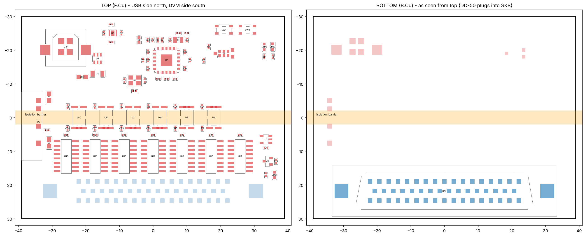

# Solartron 7075 USB interface (atopile)

An RP2354A USB interface that plugs straight into the 50-way SKB socket of a
Solartron 7075 DVM fitted with the 70754 Parallel BCD Interface Unit (service
manual, section 9). Every signal to and from the meter crosses an optical
isolation barrier, so USB ground noise never reaches the meter's ground. SKB
pin 37 is the meter's earth and logic 0.

Designed with atopile 0.15.9 (`ato build`). The parts come from atopile's
package library where it had them, and from LCSC otherwise.

## Architecture

```
 USB side (GND)                         |  DVM side (GND_ISO)
                                        |
 USB-B (vertical) -> 500 mA PTC, USBLC6 |
   +5V --+--> TLV75901 -> +3V3          |
         +--> IB0505LS-1WR3 ===========>|==> +5V_ISO (regulated, 1.5 kV)
                                        |
 RP2354A  GPIO18 SCK  --> TLP2361 ======|==> SCK_ISO   -> 5x 74HCT165 CP, 2x 74HCT595 SHCP
          GPIO19 MOSI --> TLP2361 ======|==> MOSI_ISO  -> 74HCT595 #0 DS
          GPIO17 LATCH--> TLP2361 ======|==> LATCH_ISO -> 74HCT165 /PL, 74HCT595 STCP
          GPIO20 OE_N --> TLP2361 ======|==> OE_N_ISO  -> 74HCT595 /OE (10 k pull-up)
          GPIO16 MISO <-- TLP2361 ======|<== 74HCT165 #0 Q7
          GPIO21 DRDY <-- TLP2361 ======|<== 74AHCT1G125 <- SKB 34 (PRINT level)
                                        |
                                        |   SKB 1-36  (BCD, polarity, function, range,
                                        |              print, data-can-change, overload)
                                        |              -> 5x 74HCT165 (40-bit chain)
                                        |   SKB 38, 40-50 <- 2x 74HCT595 (16-bit chain)
                                        |   SKB 39 (contact SAMPLE) <- 2N7002 to pin 37
```

* Only six logic signals cross the barrier. Each goes through a Toshiba
  TLP2361 optocoupler (15 MBd, 80 ns max delay). Every channel is
  non-inverting: the MCU or HCT output sinks the LED cathode, and the anode
  is fed from 330 Ω (3.3 V side) or 680 Ω (5 V side), about 4.5 mA.
* The DVM side uses HCT logic at 5 V because the 7075's outputs are TTL
  levels: a '1' is +2.4 to +6 V from a 6 kΩ source. The 74HCT595 outputs
  sink 6 mA at under 0.33 V, which meets the 7075 input spec of under 0.5 V
  at 5 mA.
* **Safe at reset.** While the MCU is in reset or not yet configured, its
  GPIOs are Hi-Z, so the opto LEDs are off and every isolated line idles
  high. That keeps `OE_N_ISO` high, so the 595 outputs stay Hi-Z and the
  meter's command inputs sit at its own pull-ups, exactly as if nothing were
  connected.
* Four spare 74HCT165 inputs are tied to a fixed `1010` pattern so firmware
  can detect a broken link or a missing isolated supply.

## Firmware interface

SPI0 runs in mode 0 at 1 MHz or less. The limit comes from the round trip
through two optos, about 200 ns. **LATCH must be driven as a plain GPIO**, not
as the SPI chip select, because the 74HCT165s are held in load mode while it
is low. Set GPIO17–20 to 8 mA drive.

One transaction:

1. Pulse LATCH (GPIO17) low for at least 1 µs, then return it high. The
   rising edge does two things: the 165s capture the DVM outputs, and the
   595s present the command word that was shifted in last time.
2. Exchange 5 bytes over SPI. MOSI = `00 00 00 CMD_HI CMD_LO`. MISO = 5
   status bytes.
3. To apply the new command now, pulse LATCH again. Otherwise it is applied
   at the next transaction.
4. After the first valid command has been latched, drive OE_N (GPIO20) low.

DRDY (GPIO21) follows SKB pin 34, PRINT level. It goes high when a reading is
complete and the outputs have been updated.

### Read frame (MISO, MSB first)

| Byte | bit7 … bit0 |
|---|---|
| 0 | SKB pins 1–8: 1×10⁶, 8/4/2/1×10⁵, 8/4/2×10⁴ |
| 1 | SKB pins 9–16: 1×10⁴, 8/4/2/1×10³, 8/4/2×10² |
| 2 | SKB pins 17–24: 1×10², 8/4/2/1×10¹, 8/4/2×10⁰ |
| 3 | SKB pins 25–32: 1×10⁰, +ve, −ve, function A, function B, range (4), (2), (1) |
| 4 | SKB 33 PRINT pulse, 34 PRINT level, 35 DATA CAN CHANGE, 36 OVERLOAD, then `1 0 1 0` signature |

### Command word (MOSI bytes 3–4)

| Bit | SKB pin | Meaning (manual §9) |
|---|---|---|
| 0 | 38 | FRONT PANEL LOCKOUT (0 = locked out) |
| 1 | 39 | CONTACT SAMPLE (1 = MOSFET closes 39 to 37) |
| 2 | 40 | PULSE SAMPLE (pulse high for more than 100 µs) |
| 3 | 41 | RATIO (0 = ratio) |
| 4, 5 | 42, 43 | FUNCTION. (43, 42): 11 = DC, 01 = AC, 10 = Ω, 00 = CHECK |
| 6, 7, 8 | 44, 45, 46 | Integration time (4)(2)(1): 011 = 1 ms, 100 = 20 ms, 101 = 100 ms, 110 = 1 s, 111 = 10 s |
| 9 | 47 | AUTORANGE (1 = autorange inhibited, use the commanded range) |
| 10, 11, 12 | 48, 49, 50 | Range (1)(2)(4). Read (50, 49, 48): 000 = 1000 V / 10 MΩ … 101 = 10 mV / 100 Ω, 110 = auto / 10 Ω, 111 = auto |
| 13–15 | – | unused |

Commands only take effect while the meter is in REMOTE. That means either the
REMOTE button is pressed, or bit 0 (FRONT PANEL LOCKOUT) = 0.

## Board



* 78 × 60 mm rectangle, 2 layers. It sits flat on the back of the meter and
  has no mounting holes.
* **Bottom face:** Amphenol DD50P364TXLF, a vertical PCB-mount DD-50 plug. It
  mates with SKB and is held by 4-40 jackscrews through its 3.1 mm flange
  holes. The top face is kept clear within 4 mm of each jackscrew for the
  screw heads.
* **Top face:**
  * the vertical USB-B (SHOU HAN BF 180) and the rest of the components
  * isolation barrier along the board centreline: a 3.2 mm keep-out with no
    tracks, vias or pour, crossed only by the six TLP2361s and the SIP DC-DC
  * GND pour on the USB half and GND_ISO pour on the DVM half, both layers
* `scripts/place_components.py` produces the initial placement and the zones,
  using atopile's own `PCB_Transformer`. `scripts/check_layout.py` checks:
  * every pad is inside the outline
  * no footprints overlap
  * all USB-side pads are north of the barrier and all DVM-side pads south
  * the jackscrew keep-outs are clear
* **Not done yet:** routing. Open `layouts/default/default.kicad_pcb` in
  KiCad 9 to route it and fill the zones.

## BOM (all LCSC)

| Qty | Part | LCSC |
|---|---|---|
| 1 | Raspberry Pi RP2354A (QFN-60, 2 MB flash) | C41378174 |
| 1 | Abracon ABM8-272-T3 12 MHz crystal | C20625731 |
| 1 | Abracon AOTA-B201610S3R3-101-T 3.3 µH (polarity-marked) | C42411119 |
| 1 | TI TLV75901PDRVR LDO (atopile `ti-tlv75901`) | C544759 |
| 1 | SHOU HAN BF 180 vertical USB-B | C6081376 |
| 1 | ST USBLC6-2SC6 | C7519 |
| 1 | LUTE 1206L050/36NR 500 mA PTC | C20616702 |
| 1 | YLPTEC IB0505LS-1WR3 isolated 5 V/5 V 1 W | C5369607 |
| 6 | Toshiba TLP2361 | C107626 |
| 5 | TI CD74HCT165M96 | C352828 |
| 2 | Nexperia 74HCT595D,118 | C282339 |
| 1 | TI SN74AHCT1G125DBVR | C7484 |
| 1 | 2N7002 | C8545 |
| 1 | Amphenol DD50P364TXLF vertical DD-50 plug | C5402574 |
| 2 | Alps SKRPACE010 (atopile `buttons`) | C139797 |
| 3 | KENTO 0603 LEDs, green ×2 and yellow (atopile `indicator-leds`) | C12624, C2287 |
| 1 | Tag-Connect TC2030 SWD footprint (atopile `programming-headers`) | – |
| 56 | 0402/0603/0805 basic passives (see `build/builds/default/default.bom.csv`) | |

Plus two 4-40 UNC jackscrews (check the thread of the meter's SKB screwlocks).

## Building

```
uv tool install --python 3.14 atopile==0.15.9
ato auth login     # the 0.15 part picker needs an atopile account
ato build
```

## Notes on the tool (benchmark observations)

* atopile 0.15.9 is the last CLI release. Its package registry host
  (`packages.atopileapi.com`) does not resolve, so library packages are git
  dependencies on `github.com/atopile/packages`. The part picker needs
  `ato auth login`.
* `ato create part` searches through the authenticated API. Here the parts
  were imported with the same EasyEDA ingest path it uses
  (`download_easyeda_info` + `ingest_part_from_easyeda`).
* The picker sends the correct package filter, but the backend returned
  parts in the wrong packages (1210 and through-hole parts for 0402/0805
  requests). All passives are therefore pinned to JLC basic parts with
  `lcsc_id`.
* The library `LEDIndicator` module fails to solve on 0.15.9 (circular
  `current` constraint), so the LEDs are a resistor plus the library LED part.
* `override_net_name` on an `ElectricPower.hv/lv` is ignored, because the
  stdlib already puts a name trait there. Rails are named through a helper
  `signal`.
* After swapping parts, an incremental build left some pads unconnected.
  Regenerating the PCB fixed it.

## Open items before fabrication

* Route the board in KiCad.
* Orient the RP2354A regulator inductor's polarity dot as in RP2350
  datasheet figures 26 and 28 (VREG_LX → DVDD).
* DD50P364TXLF currently shows no JLCPCB stock. It is a common Amphenol part
  (DigiKey/Mouser) and is through-hole, so hand-fit it or consign it.
* Check the 7075 rear panel for clearance around the 78 × 60 mm outline. The
  board extends from the DD-50 towards the "north" (USB) edge.
