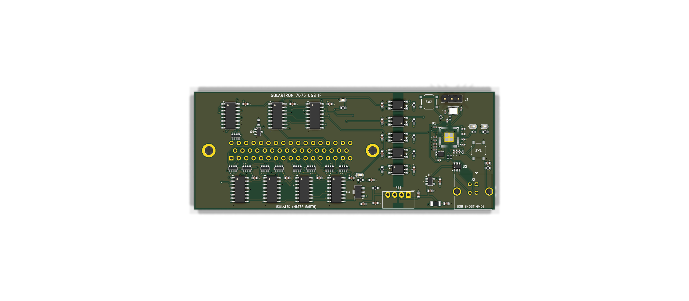
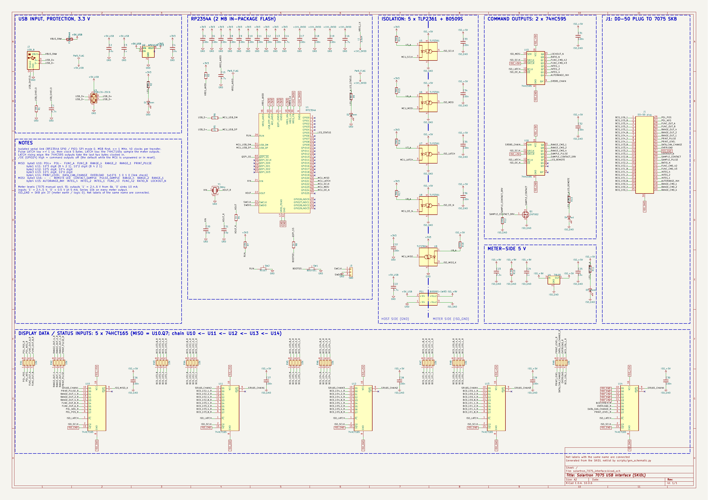
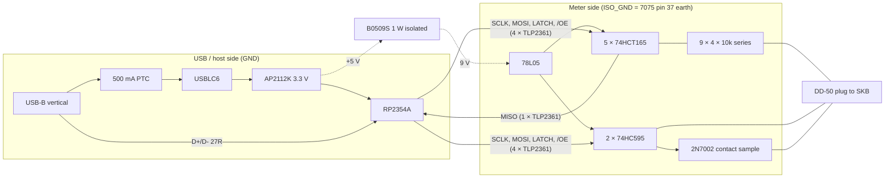
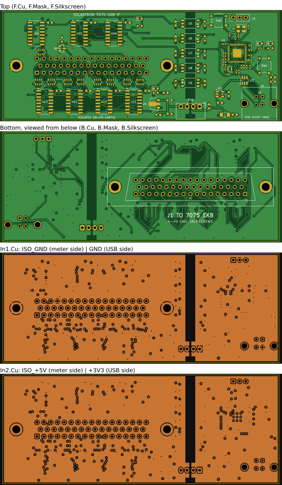

# Solartron 7075 → USB interface (SKiDL)

An isolated USB interface for the Solartron 7075 DVM, described in
[SKiDL](https://github.com/devbisme/skidl) and laid out for KiCad 10. It plugs
into the 50-way Cannon socket (**SKB**) of the 7075's Parallel BCD Interface
Unit 70754 (service manual section 9). From there it reads the display data and
status lines, drives all the remote-control inputs, and connects to a host over
USB through an RP2354A.



| | |
|---|---|
| Board | 112 × 44 mm, 4 layers, 1.6 mm, rectangular, no mounting holes |
| Meter connector | J1, DD-50 **male** (plug), vertical, mounted on the **bottom** side. Two 4-40 jackscrews through its flange holes hold the board on the instrument |
| Host connector | J2, USB-B **vertical** (TE 5787834-1), mounted on the **top** side at the other end of the board |
| MCU | RP2354A (RP2350 with 2 MB of flash in the package), 12 MHz crystal, SWD header, BOOTSEL and RESET buttons |
| Isolation | 5 × TLP2361 optocouplers (4 to the meter, 1 back) + B0509S isolated DC/DC. There is a 4 mm copper-free gap between the domains (0.8 mm at the DC/DC pins) |
| Meter side | 5 × 74HCT165 (36 inputs + 4 check bits), 2 × 74HC595 (13 command outputs), supplied from its own regulated 5 V |
| Checks | SKiDL ERC: 0 errors / 0 warnings. Schematic ERC (KiCad 10, all severities): 0 violations (`pcb/erc_report.txt`). DRC with schematic parity (all severities): **0 violations, 0 unconnected, 0 parity errors** (`pcb/drc_report.txt`) |

## Schematic

[](pcb/render/schematic.pdf)

One A2 sheet (`pcb/solartron_7075_interface.kicad_sch`, PDF in
`pcb/render/schematic.pdf`), grouped by function: USB input and 3.3 V, the
RP2354A, the isolation barrier (drawn as a dashed line through the
optocouplers and the DC/DC), the 595 command outputs, the meter-side 5 V, J1,
and the 165 input chain along the bottom. Labels with the same name are
connected.

SKiDL's own schematic output is not usable on this design (see
[Tool issues](#tool-issues)), so `scripts/gen_schematic.py` draws the sheet from
the SKiDL netlist. Part positions are set by hand per block; every pin then
gets a stub with a net label, power symbol or no-connect flag. The script
re-exports the netlist from the drawn sheet with `kicad-cli` and fails unless
every net has the same pins and the same name as in the SKiDL netlist.
`scripts/link_schematic.py` then ties the board's footprints to the symbols,
so KiCad's schematic-parity DRC and cross-probing work.

## How it works



* **Five signals cross the barrier.** SCLK, MOSI, LATCH and /OE go to the
  meter, and MISO comes back. Every meter output is captured by the 165 chain,
  and every meter input is driven by the 595 chain.
* **One LATCH line serves both chains.** LATCH low makes the 74HCT165s load
  (snapshot) the meter outputs. The rising edge of LATCH copies the 74HC595
  shift registers to their outputs.
* **The command outputs are safe at power-up.** The /OE optocoupler output sits
  high whenever its LED is off (MCU unpowered, in reset, or not yet
  initialised), so the 595 outputs stay high-impedance. The meter's TTL inputs
  then float to '1', which is the "nothing commanded" state. The manual notes
  that an unconnected interface leaves the meter in 10 s / DC V. The
  CONTACT-SAMPLE MOSFET has a 100 k gate pull-down for the same reason.
* **Logic levels follow the section-9 spec.**
  * Meter outputs are '1' = 2.4…6 V from a 6 kΩ source, so the 165s are
    **HCT** parts with TTL thresholds (V<sub>IH</sub> 2.0 V).
  * Each meter output passes through a 10 kΩ series resistor in a 4-way array.
    This limits ESD current and back-feeding when only one side is powered.
  * Meter inputs need '0' < 0.5 V at 5 mA sink and '1' < +5 V. The 74HC595
    meets both on a regulated 5 V.
  * That is why the meter side uses B0509S → 78L05 rather than an unregulated
    5 V → 5 V module. Such a module only holds 5 V above about 10 % load
    (20 mA), and this board draws about 15 mA, so its output would drift
    above the meter's input limit.
* **CONTACT SAMPLE** (pin 39) wants a real closure to pin 37, so it gets a
  2N7002. **PULSE SAMPLE** (pin 40) is driven directly (+5 V, keep it high for
  more than 100 µs).
* **Optocouplers.** The TLP2361 is a 15 MBd part with a totem-pole output and a
  threshold of ≤ 1.6 mA, so logic can drive its LED directly.
  * MCU side: 390 Ω from 3.3 V gives ≈ 3.6 mA.
  * Meter side: 820 Ω from 5 V gives ≈ 3.9 mA.
  * The LED cathode is pulled low by the driving logic, so each channel is
    non-inverting overall.

### RP2354A pin use

| GPIO | Pin | Function |
|---|---|---|
| GPIO20 | 32 | MISO (SPI0 RX) ← U9 |
| GPIO21 | 33 | LATCH → U7 |
| GPIO22 | 34 | SCLK (SPI0 SCK) → U5 |
| GPIO23 | 35 | MOSI (SPI0 TX) → U6 |
| GPIO24 | 36 | /OE of the 595s → U8 (drive low only after the first valid transfer) |
| GPIO5 | 8 | status LED D2 (active high) |
| SWCLK/SWDIO | 24/25 | J3 (SWCLK, GND, SWDIO) |
| QSPI_SS | 60 | BOOTSEL button SW1 (1 k) |
| RUN | 26 | RESET button SW2, 10 k pull-up |

GPIO20–24 are contiguous, so a single PIO program can drive them as well as
hardware SPI0. The QSPI pins are unconnected because the flash is inside the
RP2354A package.

## Transfer protocol and bit maps

Each transfer is 40 clocks: SPI mode 0, MSB first, SCLK ≤ 1 MHz recommended.
The optocouplers add about 0.2 µs round trip, which leaves plenty of margin
up to about 2 MHz.

1. Pulse LATCH low for ≥ 1 µs, then return it high. The pulse snapshots the
   meter outputs into the 165s. Its rising edge applies the command bytes sent
   in the previous transfer.
2. Clock 5 bytes. Read bytes 0–4 from MISO and send the command bytes on MOSI.
   Only the last two bytes sent stay in the 595 chain.
3. To apply new commands immediately, pulse LATCH again.

**MISO, bytes 0–4 (MSB first):**

| Byte | Register | bit7 … bit0 |
|---|---|---|
| 0 | U10 | POL+ (26), POL− (27), FUNC A (28), FUNC B (29), RANGE 4 (30), RANGE 2 (31), RANGE 1 (32), PRINT PULSE (33) |
| 1 | U11 | 10³ digit 8 4 2 1 (pins 10–13), 10² digit 8 4 2 1 (14–17) |
| 2 | U12 | 10⁵ digit (2–5), 10⁴ digit (6–9) |
| 3 | U13 | 10¹ digit (18–21), 10⁰ digit (22–25) |
| 4 | U14 | PRINT LEVEL (34), DATA CAN CHANGE (35), OVERLOAD (36), 1 × 10⁶ (1), **1 0 1 0** |

The low nibble of byte 4 is wired to a fixed `1010` pattern on the meter side.
If it reads back as anything else, the link is broken or the isolated side is
unpowered: an unpowered side reads as all ones.

**MOSI, bytes 3 and 4 (the last two sent):**

| Byte | Register | bit7 (QH) … bit0 (QA) |
|---|---|---|
| 3 | U16 | –, –, REMOTE LED D4, CONTACT SAMPLE (39, via Q1, 1 = close), PULSE SAMPLE (40), RANGE 4 (50), RANGE 2 (49), RANGE 1 (48) |
| 4 | U15 | AUTORANGE inhibit (47), INTEG 4 (44), INTEG 2 (45), INTEG 1 (46), FUNC (43), FUNC (42), RATIO (41, 0 = ratio), FRONT PANEL LOCKOUT (38, 0 = lockout/remote) |

Bytes 0–2 on MOSI are don't-care: they fall out of the end of the 595 chain.

Typical remote measurement:

1. Write the function, range and integration codes from the manual's tables,
   with LOCKOUT = 0.
2. Set PULSE SAMPLE = 1, wait ≥ 100 µs, then set it back to 0. Each change
   is one transfer plus a LATCH pulse.
3. Poll until PRINT LEVEL = 1.
4. Read the BCD digits, polarity, range and function codes from the same
   snapshot.

## Connector pin map (J1 ↔ 70754 SKB)

| SKB pin | Signal | Board net | SKB pin | Signal | Board net |
|---|---|---|---|---|---|
| 1 | 1 × 10⁶ | BCD_1E6_1 | 26 / 27 | +ve / −ve polarity | POL_POS / POL_NEG |
| 2–5 | 8,4,2,1 × 10⁵ | BCD_1E5_* | 28 / 29 | function out | FUNC_OUT_A / B |
| 6–9 | × 10⁴ | BCD_1E4_* | 30 / 31 / 32 | range out (4/2/1) | RANGE_OUT_* |
| 10–13 | × 10³ | BCD_1E3_* | 33 / 34 | print pulse / level | PRINT_PULSE / PRINT_LEVEL |
| 14–17 | × 10² | BCD_1E2_* | 35 / 36 | data can change / overload | DATA_CAN_CHANGE / OVERLOAD |
| 18–21 | × 10¹ | BCD_1E1_* | 37 | earth / logic 0 | **ISO_GND** (+ J1 shell) |
| 22–25 | × 10⁰ | BCD_1E0_* | 38–50 | command inputs | see MOSI map |

## Mechanical notes

* **J1 is on the underside**, centred at (36, 22) mm in the KiCad top view.
  * Its pins 1–17 (the wide row of the D) face the board's lower edge, the edge
    with the "ISOLATED (METER EARTH)" legend.
  * The jackscrew holes are Ø 3.2 mm at (5.445, 22) and (66.555, 22), 61.11 mm
    apart (DD-50 standard).
  * Fit two 4-40 UNC jackscrews or thumbscrews from the top through the board
    and the connector flange into the socket's screw-locks. Thread length should
    be ≥ 10 mm (1.6 mm board + flange + engagement).
  * No other parts sit on the underside. Keep at least 3 mm of clearance around
    the screw heads on top, which the layout already does.
* The board stands off the instrument by roughly the connector's body height,
  about 12 mm for the Amphenol Delta-D straight series. Check this against the
  part you buy.
* Relative to the socket, the board extends 36 mm on the J1 side and 76 mm on
  the USB side. If something on your unit is in the way on that side, J1's
  orientation can be changed in `scripts/layout_pcb.py` (`j1_ok`). Everything
  else then needs re-placing.
* The vertical USB-B on the top face points away from the instrument.

## Parts and sourcing

* Every part has an LCSC code. The grouped BOM with MPNs is in
  `output/bom.csv`, and the JLCPCB-format BOM and CPL are in `pcb/fab/`.
* Symbols and footprints come from the stock KiCad 10 libraries, except:
  * **J1:** KiCad 10 has no 50-way D-sub. `scripts/gen_dd50_footprint.py` and
    `scripts/gen_symbols.py` generate `lib/Solartron7075.*` from the Amphenol
    Delta-D drawing.
  * **TLP2361:** there is no KiCad symbol, so the identically-pinned
    `Isolator:TLP2310` symbol is used (SO6 with 5 leads: A 1, K 3, GND 4, VO 5,
    VCC 6). The footprint is `Toshiba_SOIC-5-6`.
  * **B0509S-1WR3:** uses the Murata MEE1 symbol and footprint, which have the
    same SIP-4 pinout.
* **J1 (Amphenol D50P24A4PA00LF, C17502305)** was listed on LCSC without stock
  at design time. Any straight-PCB DD-50 plug with plain 3.1 mm flange holes on
  the standard 2.77 × 2.84 mm grid fits. Don't use one with female screw-locks.
* The jackscrews are not on LCSC.
* Power budget is under 120 mA from USB:
  * RP2354A: ~30 mA
  * Opto LEDs: ≤ 15 mA
  * LEDs: ~5 mA
  * Isolated side: ≈ 15 mA at 5 V, ≈ 40 mA at the DC/DC input
* Isolation is **functional**: its purpose is to break the USB/earth ground loop
  and keep USB noise away from the meter. It is not a safety barrier. The
  TLP2361s are rated 3.75 kV<sub>rms</sub> and the B0509S 1.5 kV DC.

## Gerbers and prints

| File | Contents |
|---|---|
| `pcb/fab/gerbers.zip` | Gerbers for 4 layers, mask, paste, silkscreen and outline, plus Excellon drill files (PTH; the NPTH file is empty) and drill maps. Upload this to the board house |
| `pcb/fab/bom_jlcpcb.csv`, `pcb/fab/cpl_jlcpcb.csv` | JLCPCB assembly BOM and placement |
| `pcb/print/pcb_prints.pdf` | 7 A4 pages, black and white, with title block: top and bottom assembly (fab layers, pads sketched), F.Cu, In1.Cu, In2.Cu and B.Cu, all at 2:1, then a 1:1 bottom view for a fit check |
| `pcb/print/gerber_preview.png` | the Gerber and drill files rendered by gerbv, independently of KiCad |
| `pcb/render/` | KiCad 3D renders and a colour multi-layer PDF |

For the fit check, print page 7 at 100 % ("actual size"). The board outline
there should measure 112 × 44 mm. Hold it against the meter's SKB socket to
check the jackscrew holes, the pin rows and the overhang on each side. Bottom
views (pages 2, 6 and 7) are mirrored, so they show the board as seen from
the meter side.

[](pcb/print/gerber_preview.png)

## Files

| Path | What |
|---|---|
| `solartron_7075_interface.py` | the SKiDL design (all parts, nets, LCSC/MPN fields) |
| `lib/` | generated DD-50 symbol + footprint |
| `scripts/gen_dd50_footprint.py`, `scripts/gen_symbols.py` | library generators |
| `scripts/layout_pcb.py` | placement, stack-up, rules, planes, isolation keep-outs, silkscreen |
| `scripts/route_pcb.py`, `scripts/fanout.py` | QFN hand fan-out, plane vias, Freerouting, clean-up, ground pours |
| `scripts/gen_schematic.py` | draws the single-page schematic from the netlist and checks it (`--check`) |
| `scripts/link_schematic.py` | links the routed board to the schematic (symbol paths, net names) |
| `scripts/make_bom.py`, `scripts/jlc_cpl.py` | BOM and placement files |
| `scripts/make_prints.py` | the print PDF and the Gerber preview |
| `build.sh` | runs the whole flow |
| `CONVERSATION.md` | export of the Claude Code session that produced this design, with its time and token totals |
| `scripts/session_breakdown.py`, `stats/breakdown_calls.csv` | the split of the session statistics by kind of work, and the category of every API call |
| `output/` | SKiDL netlist, ERC log, BOM, unplaced board straight from SKiDL |
| `pcb/` | KiCad 10 project: schematic, routed board, ERC and DRC reports, `render/` (schematic PDF/PNG, board renders), `print/` (prints, Gerber preview), `fab/` (Gerbers, drill, BOM, CPL) |

## Rebuilding

Tested with KiCad 10.0.6 (Ubuntu PPA), SKiDL 2.3.0 with kinet2pcb 1.1.4,
Freerouting 2.5.0 (needs Java 25), and Python 3.12. Use the system Python,
because it has KiCad's `pcbnew` module. The prints need `pdfunite` and
`pdftoppm` (poppler-utils) and ImageMagick. `gerbv` is optional; without it the
Gerber preview is skipped.

```sh
python3 -m venv --system-site-packages .venv && .venv/bin/pip install skidl
SKIDL_PYTHON=.venv/bin/python FREEROUTING_JAR=/path/freerouting-2.5.0-executable.jar \
JAVA=/usr/lib/jvm/java-25-openjdk-amd64/bin/java ./build.sh
```

The full run takes about 8 minutes, mostly in Freerouting's optimiser.
Freerouting is not fully deterministic, so a rebuild gives a board that is
equivalent but not byte-identical. The committed board is the one checked by
`pcb/drc_report.txt`.

## Session statistics breakdown

The root README's Breakdown table for SKiDL comes from
`scripts/session_breakdown.py`, which reads the session's Claude Code
transcript. The category of each of the 347 API calls is listed in
`stats/breakdown_calls.csv`. Notes on the method:

* **Span.** The span runs from the first prompt to the request to export the
  conversation, the same as the Results row. This session has not had the
  review comments yet.
* **Categories.** Calls are assigned by hand, from index ranges in the script.
  The less obvious calls:
  * Installing KiCad and SKiDL counts as tool research. Freerouting, Java and
    the 3D models count as PCB.
  * Checking which footprints fit the chosen parts counts as PCB, and so does
    the DD-50 footprint.
  * The BOM and the later LED and passive swaps count as part selection.
  * Linking the board to the schematic (`link_schematic.py`, the parity DRC)
    counts as PCB.
* **Cache rewrite.** "Other" includes a 0.62 M-token prompt-cache write
  (about $5). The first call after the 6 h pause at the usage limit had to
  re-cache the whole conversation, and that call was a `git status` check.
* **Not attributable.** This column holds the automatic compaction (77 s) and
  1.13 M tokens that the cost counter includes but the transcript does not log
  per call.
* **Prices.** The fitted prices are $4.41 per million input tokens, $8.00 for
  cache writes, $0.200 for cache reads and $20.03 for output.
  * They reproduce all four of the session's cost snapshots to within 1e-13
    dollars.
  * Four snapshots and four prices make the fit exact. So it is checked only
    by the other three prices coming out as round figures.
  * The input price is poorly determined, because there are only 5 k uncached
    input tokens. Its effect on any column is under $0.02.

## Tool issues

Problems with SKiDL, kinet2pcb, Freerouting and the KiCad libraries, and what
this flow does about them.

* **SKiDL schematic generator.** SKiDL 2.3's KiCad 10 schematic output
  (`SKIDL_SCH=1`, hierarchical or flat) runs, but on this design it draws some
  power symbols and labels touching other nets. KiCad's netlist export of the
  result merges nets, e.g. +3V3 with +1V1_DVDD, and puts decoupling caps on the
  wrong rails. It is off by default. The shipped sheet comes from
  `scripts/gen_schematic.py` and is checked against the netlist, as described
  under [Schematic](#schematic).
* **kinet2pcb:**
  * It can't parse KiCad 10's quoted `fp-lib-table` entries, so the footprint
    directories are passed explicitly.
  * It puts every no-connect pin on one shared `__NOCONNECT` net, so
    `layout_pcb.py` detaches them.
  * Its footprints carry no symbol paths, so the board is not linked to any
    schematic. `link_schematic.py` adds the paths and BOM fields, renames nets
    the way KiCad's "Update PCB from Schematic" would (local-label nets become
    `/NAME`), and gives no-connect pins their `unconnected-(…)` nets.
* **SKiDL pin names.** SKiDL mangles pin names containing `'` (the 595's
  `QH'`), so pin numbers are used there.
* **Freerouting** doesn't drop vias into the inner planes by itself, and it
  can't escape the RP2354A's 0.4 mm-pitch supply pins. The QFN fan-out and the
  plane vias are pre-routed and locked, and Freerouting routes the rest. It is
  also not fully deterministic (see [Rebuilding](#rebuilding)).
* **KiCad libraries.** There is no 50-way D-sub footprint or TLP2361 symbol,
  so these are generated or substituted (see
  [Parts and sourcing](#parts-and-sourcing)). The 3D library has no models for
  the DD-50, the vertical USB-B, the TS-1187A switches, the MEE1/B0509S or the
  QFN-60, so those parts are missing from the renders.

## Design caveats

* **Not built or bench-tested.** Before ordering:
  * Check J1's footprint against the datasheet of the plug you actually buy.
  * Check the jackscrew thread and the socket orientation on your 70754.
  * Check the orientation of every part in JLCPCB's placement preview.
* **Power sequencing.** If the meter is switched off while the board is powered
  and /OE is enabled, the 595 outputs back-feed the meter's TTL inputs.
  Firmware should release /OE when the meter outputs read implausibly, for
  example everything low.
* The 595s' '1' level is the 78L05 output, 5.0 V ± 4 %. The manual gives
  "< +5 V" for its inputs, which the TTL inputs tolerate.
* J1 had no LCSC stock at design time, and the jackscrews are not on LCSC (see
  [Parts and sourcing](#parts-and-sourcing)).
* Isolation is functional, not a safety barrier.
* No firmware is included.
