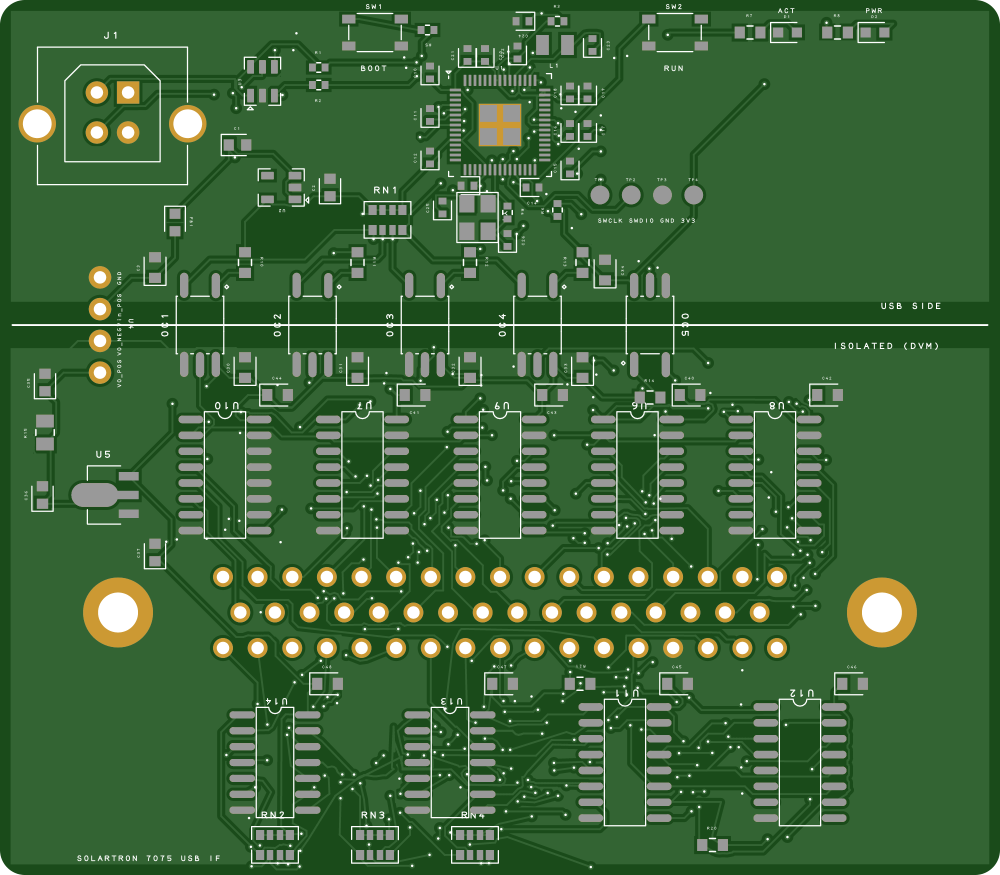

# Solartron 7075 USB interface (tscircuit)

An RP2354A USB interface for the Solartron (Schlumberger) 7075 DVM. It plugs into
socket **SKB**, the 50-way D on the **70754 Parallel BCD Interface Unit**
(manual Section 9, `../inputs/solartron_7075_service_manual.pdf`). The board can
read every DVM output and drive every remote command. All DVM signals are
optically isolated from USB ground.

```
USB-B ─ ESD ─┬─ AP2112K 3.3 V ─ RP2354A ── SPI0 ──┐
             │                                     │  5 x TLP2361 optocouplers
             └─ ferrite ─ B0505S-1WR3 (isolated) ──┼───────────────────────────
                             │                     │
                         HT7533 3V3_ISO     SCK MOSI LATCH OE_N │ MISO
                                                   │            │
                     2 x 74LV595A ─ 2 x 74LVC07A ──┤      5 x 74LV165A
                       (13 commands, open drain)   │      (36 DVM outputs)
                                                   └── DD-50 plug ── SKB (70754)
```

## Files

| Path | Contents |
| --- | --- |
| `index.circuit.tsx` | Board outline, copper pours either side of the barrier, top-level assembly |
| `lib/sections/UsbPower.tsx` | USB-B socket, USBLC6 ESD, 3.3 V LDO, DC-DC input filter |
| `lib/sections/Mcu.tsx` | RP2354A, core regulator, crystal, BOOTSEL/RUN, SWD pads, LEDs |
| `lib/sections/Isolation.tsx` | TLP2361 barrier and isolated DC-DC converter |
| `lib/sections/DvmInterface.tsx` | Isolated 3.3 V, shift registers, open-drain drivers, D-sub |
| `lib/solartronSkb.ts` | SKB pin table transcribed from manual p. 9.9 and bit maps for firmware |
| `lib/DSub50MaleVertical.tsx` | DD-50 vertical plug footprint (no LCSC/EasyEDA footprint available) |
| `lib/passives.tsx` | Resistor/capacitor values pinned to LCSC part numbers |
| `lib/schLayout.ts` | Schematic grouping helpers (decoupling caps per rail) |
| `outputs/` | Exported schematic, PCB prints and renders, netlist and Gerbers of the routed board |
| `scripts/` | Export, fabrication fix-up, print and verification scripts (see below) |
| `lib/common/` | Parts reused from [tscircuit/common](https://github.com/tscircuit/common) (MIT) |
| `imports/` | Parts imported from LCSC/JLCPCB with `tsci import` |

## Build

```sh
cd tscircuit
npm install
npm run build      # tsci build: place, autoroute (~5 min), dist/index/{circuit.json,pcb.png,schematic.png}
npm run check      # netlist + placement DRC, copper shorts, isolation barrier check
npm run export     # outputs/: schematic, Gerbers, PCB prints/renders, netlist (from dist, no re-route)
```

`npm run export` makes the Gerbers in three steps:

1. `scripts/prepare-fab.mjs` writes `dist/fab/circuit.json`, a copy of the
   routed board with two `tsci` export problems fixed. Copper, mask, silk and
   drill geometry are unchanged:
   - **Solder paste.** tscircuit 0.0.2745 gives pill and polygon pads no paste,
     which is every SOIC, TLP2361 and the SOT-89 tab. It also puts paste on
     every through-hole and uses 70 % apertures, which are too small for the
     RP2354A's 0.2 mm pins. The stencil is rebuilt with 1:1 apertures, a 2 x 2
     windowpane on the RP2354A exposed pad, and no paste on through-holes.
   - **`%LR` rotation.** U2's and U3's pads are written as a rotated aperture,
     using the Gerber `%LR` command. Older viewers and CAM tools ignore `%LR`,
     and U3's pads then merge into shorts. These pads are rewritten as plain
     rectangles of the same outline.
2. `tsci export -f gerbers` turns that copy into `outputs/gerbers.zip`.
3. `scripts/pcb-prints.mjs` renders `gerbers.zip` with tracespace into
   `pcb-prints.pdf` and `pcb-render-{top,bottom}.png`. The prints therefore show
   exactly what the fab receives.

The routed result is committed in `outputs/`:



- `gerbers.zip`: Gerbers (X2, mm) and an Excellon drill file, with `bom.csv` and
  `pick_and_place.csv` carrying JLCPCB part numbers. Upload it to JLCPCB as it is.
- `pcb-prints.pdf`: seven A4 landscape sheets. Print them at 100 %; a scale bar
  on every sheet checks the size.
  1. Top and bottom views at 1:1, to check fit against the 70754.
  2. Top copper, 2:1.
  3. Bottom copper, 2:1.
  4. Top assembly, 2:1, with reference designators.
  5. Bottom assembly, 2:1, mirrored.
  6. Top stencil, 2:1.
  7. Drill drawing and drill table, 2:1.

  Every sheet is vector except the two renders on sheet 1.
- `pcb-render-top.png` and `pcb-render-bottom.png`: photo-style renders made
  from the Gerbers.
- `schematic.svg` and `schematic.pdf`. The PDF is a vector page at A1 width,
  made by `scripts/svg-to-pdf.mjs`, because `tsci`'s own PDF export is a
  144 dpi bitmap.
- `pcb-top.svg` and `pcb-bottom.svg`: tscircuit's own PCB views.
- `netlist.txt`.

The board is 2 layers, with 0.15 mm tracks and 0.2 mm/0.45 mm vias, which
JLCPCB builds at standard pricing.

Verification of the committed board:

- Every connection is routed and `tsci check shorts` passes.
- `scripts/check-isolation.mjs` finds no trace or via crossing the barrier.
- The Gerbers were checked in an independent viewer (tracespace), and the
  prints are drawn from it. Against the plain `tsci` export, copper, mask, silk,
  outline and drill are identical once aperture numbering is normalised, apart
  from the 11 U2/U3 pads rewritten without `%LR`. Only the paste layers differ
  in substance.
- The only DRC item is a via on net `DVM_D4_2` overlapping the toe of its own
  pad, U6 pin 11. It is the same net, so it is harmless electrically; move it
  off the pad during final review if the board is assembled by reflow.
- The tscircuit autorouter (capacity-autorouter 0.0.958) is very sensitive to
  small placement changes. Re-run `npm run check` after any edit, because a new
  route can differ.
- Check JLCPCB pick-and-place rotations in their preview. The exporter cannot
  verify pin-1 rotation for the SOICs and some imported parts.

## Mechanical

- The board is 80 x 70 mm, 2 layers, with no mounting holes. It hangs off the D-sub.
- **J2 (DD-50 plug, vertical) is on the bottom side** and faces the 70754. Fit
  4-40 UNC jackscrews through J2's 3.2 mm flange holes into SKB's screwlocks.
- **J1 (USB-B, vertical) is on the top side**, so the cable leaves straight out
  the back.
- All SMD parts are on the top side. The only parts on the bottom side are J2 and
  the THT leads of J1 and U4. Trim those leads short, because the bottom face
  sits a few mm from the 70754 housing.

## Isolation

- The barrier is the row of optocouplers across the board (silkscreen line,
  `BARRIER_Y` in `Isolation.tsx`). `GND`/`V3V3` (USB) are above it and
  `GND_ISO`/`V3V3_ISO` (DVM) are below. Both copper pours stop 1.6 mm either
  side of the line, and a 1.8 mm copper `<keepout>` on both layers stops the
  autorouter from taking any trace or via across it. This gives ≥ 4 mm
  pad-to-pad creepage through each TLP2361. `scripts/check-isolation.mjs`
  checks the routed board. The aim is to break ground loops and keep USB noise out of the DVM.
  It is not a safety isolation design.
- SKB has no supply pin. The isolated side is therefore powered by a
  B0505S-1WR3 1 W module followed by an HT7533 LDO. R15 (470 Ω) provides the
  module's 10 % minimum load.
- Only five signals cross the barrier: SCK, MOSI, LATCH and OE_N to the DVM side, and MISO back.

### Why 3.3 V logic, 74LV165A and open-drain outputs on the DVM side

- The manual (p. 9.2) says an unconnected interface reverts to "DC, 10 s". That
  means SKB inputs float to logic 1, so they are meant to be pulled low by
  contacts or open collectors. Every command except pulse-sample goes through a
  74LVC07A open-drain buffer. These buffers have Ioff, so **when the board is
  unpowered the D-sub lines are high impedance and the DVM front panel works
  normally**. A push-pull 74HC595 would pull FRONT PANEL LOCKOUT (pin 38) low.
- The 74LV165A inputs are 5.5 V tolerant and have Ioff, and at 3.3 V their VIH is
  2.31 V. They therefore read the 70754's TTL outputs (VOH ≥ 2.4 V) directly,
  with no pull-ups, and nothing back-feeds the isolated rail from the DVM.
- The 74LVC07A inputs have 10k pull-ups and the 74LV595A outputs stay disabled
  (OE_N high) until firmware enables them. At power-up every DVM input therefore
  stays at its idle 1.
- Pin 40 (pulse sample, +3 to +8 V) is driven push-pull from a spare 74LV595A
  bit through 100 Ω. 3.3 V meets the +3 V minimum. Pin 39 (contact sample) is
  the preferred trigger.

## Firmware interface

RP2354A pins: GPIO2 = SCK, GPIO3 = MOSI (SPI0 TX), GPIO4 = MISO (SPI0 RX),
GPIO5 = LATCH, GPIO6 = OE_N, GPIO25 = activity LED. Every link is
non-inverting: GPIO low means the DVM-side signal is low. The TLP2361 is
specified to 15 Mbit/s, but the MISO round trip is about 200 ns, so run SPI
mode 0 at ≤ 2 MHz (one 40-bit frame takes about 20 µs at 2 MHz).

One transaction:

1. Drive LATCH low for at least 1 µs, then high. The low phase makes the
   74LV165As capture the DVM outputs. The rising edge loads the 74LV595A
   outputs with the previous frame's last 16 bits.
2. Clock 40 bits (5 bytes) MSB first.
   - **MISO:** bit k (k = 0 ... 39, first bit received = 0) is SKB pin k+1, so
     bits 0-24 are BCD 1x10^6 ... 1x10^0, 25-26 polarity, 27-28 function,
     29-31 range, 32 PRINT pulse, 33 PRINT level, 34 DATA CAN CHANGE,
     35 overload, and 36-39 read 0.
   - **MOSI:** the last 16 bits clocked out are the command word, b15 first,
     b0 last. Writing a command takes effect at the next LATCH rising edge, so
     to change commands send the frame, then pulse LATCH again.
3. After the first frame, drive OE_N low to enable the outputs. It is pulled
   high, so the command outputs are disabled while the RP2354A is in reset or
   BOOTSEL.

Command word: write the manual's logic levels directly (1 = high/idle).

| bit | SKB pin | function |
| --- | --- | --- |
| 0 | 38 | FRONT PANEL LOCKOUT (0 = lockout) |
| 1 | 39 | CONTACT SAMPLE (0 = contact closed) |
| 2 | 41 | RATIO (0 = ratio) |
| 3 | 42 | function select (with 43: 11 DC, 01 AC, 10 Ω, 00 check) |
| 4 | 43 | function select |
| 5, 6, 7 | 44, 45, 46 | integration time 4/2/1 (011 1 ms ... 111 10 s) |
| 8 | 47 | AUTORANGE inhibit (1 = use range command) |
| 9, 10, 11 | 48, 49, 50 | range 1/2/4 |
| 12 | 40 | PULSE SAMPLE (push-pull, idle 0, pulse > 100 µs) |
| 13-15 | - | spare (U12 QF..QH, unconnected) |

The idle word is `0x0FFF`. A reading is complete when PRINT level (MISO bit 33)
is 1. The level stays high until the next sample, so polling is enough and no
interrupt line is needed.

## Bill of materials

Parts come from tscircuit/common first, then from LCSC.

| Ref | Part | LCSC | Source / note |
| --- | --- | --- | --- |
| U1 | RP2354A (RP2350A + 2 MB flash), QFN-60 | C41378174 | LCSC |
| U2 | AP2112K-3.3TRG1 LDO | C23380830 | tscircuit/common |
| U3 | USBLC6-2SC6 ESD | C7519 | LCSC |
| U4 | B0505S-1WR3 isolated 1 W DC-DC (HI-LINK) | C5183119 | LCSC |
| U5 | HT7533-1 LDO, 30 V in | C14289 | LCSC basic |
| U6-U10 | SN74LV165ADR | C273656 | LCSC |
| U11, U12 | SN74LV595ADR | C205940 | LCSC |
| U13, U14 | SN74LVC07ADR | C7659 | LCSC |
| OC1-OC5 | TLP2361(TPL,E) 15 Mbit/s optocoupler | C107626 | LCSC |
| J1 | USB-B vertical, THT (SHOU HAN BF 180) | C6081376 | LCSC |
| J2 | DD-50 plug, vertical PCB, Amphenol DD50P364TXLF | C5402574 | LCSC lists it but stock is 0. Alternatives: Assmann A-DS 50 PP/Z, Norcomp 171-050-103L001 (standard footprint) |
| Y1 | ABM8-272-T3 12 MHz | C20625731 | LCSC. This is the RP2350 datasheet's required crystal, used instead of common's X322512MSB4SI |
| L1 | AOTA-B201610S3R3-101-T 3.3 µH | C42411119 | LCSC. This is the RP2350 regulator inductor |
| FB1 | BLM18PG121SN1D | C14709 | tscircuit/common |
| SW1, SW2 | SKRPACE010 | C139797 | tscircuit/common |
| D1, D2 | XL-1608SURC-06 | C965799 | tscircuit/common |
| C1, C2, C35-C37 | CL10A106KP8NNNC 10 µF 0603 | C19702 | tscircuit/common |
| RN1-RN4 | 4D03WGJ0103T5E 4 x 10k | C29718 | LCSC basic |
| passives | see `lib/passives.tsx` | | LCSC basic where available |

## Assumptions and caveats

- This assumes the 70754 unit is fitted and the board mates with its SKB
  socket. The raw DVM socket behind the 70754 (PLA/SK1) carries a different,
  serialised interface.
- SKB and PLA are listed as "50 way Cannon" (DD-50, plug on the 70754 side of
  PLA, socket SKB). Check SKB's gender and screwlock thread on the actual unit
  before ordering J2.
- The manual does not state the input pull-up values. Open-drain drive relies
  on the inputs idling high, which the manual describes. If a particular input
  turns out not to have a pull-up, add one on the DVM side to the 70754's +5 V,
  not to `V3V3_ISO`.
